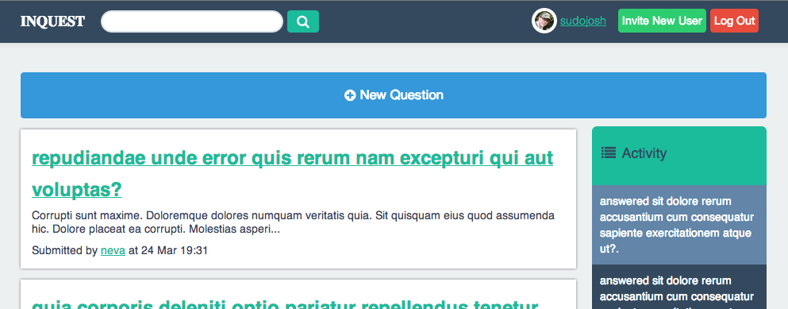

# inquest

[](https://codeclimate.com/github/joshmcarthur/inquest) [](https://travis-ci.org/joshmcarthur/inquest)


Inquest is a host-your own, private Q&A application, a la StackOverflow. Created at Railscamp NZ '13. World, meet Inquest:




---

### Features:

Take a look at the development Trello board for what's complete, what's being worked on, and what's in the backlog:

#### [Trello Board](https://trello.com/board/inquest-development/514f7c67000aa67f660056d8)

### Setup:

1. Clone the repository and change directory:
  ``` bash
    git clone git@github.com:joshmcarthur/inquest.git
    cd inquest
  ```
2. Install dependencies:
  ``` bash
    bundle install --without development test
  ```
3. Configure and create database:
	``` bash
	 cp config/database.yml.example config/database.yml
	```
	
	and add configuration for `production`:
	
	``` yaml
	test:
  		adapter: postgresql
		database: inquest_production
		user: postgres
	```
	
	and then set up the database:
	
	``` bash
	bundle exec rake db:create
	bundle exec rake db:schema:load
	```
  
4. Configure ActionMailer:
  ``` bash
    vim config/environments/production.rb
  ```
  
  and add something like the following:
  ``` ruby
  	config.action_mailer.delivery_method = :smtp
	config.action_mailer.smtp_settings = {
	  :address              => "smtp.gmail.com",
	  :port                 => 587,
 	  :domain               => '< YOUR DOMAIN or gmail.com>',
	  :user_name            => '< A GMAIL USERNAME >',
	  :password             => '< GOOGLE ACCOUNT PASSWORD >',
	  :authentication       => 'plain',
	  :enable_starttls_auto => true  
	}
  ```
  
5. Configure the email address that will be used for user notifications:
	``` bash
	  vim config/initializers/devise.rb
	```
	
	and change the email address to be used:
	``` ruby
	  config.mailer_sender = "< NOTIFICATION FROM ADDRESS >"
	```
	
6. Precompile assets:
	``` bash
		bundle exec rake assets:precompile
	```
	
7. Start server:
	``` bash
		bundle exec rails s production
	```

8. Go ahead and set up your webserver to serve the Rails app through Apache or Nginx!

### Getting Started with Development:


1. Fork the project on Github, and then clone your copy of the repo and cd into the new project
  ``` bash
    git clone git@github.com:< YOUR GITHUB USERNAME >/inquest.git
    cd inquest
  ```

2. Create a database
  ``` bash
    cp config/database.yml.example config/database.yml
    rake db:setup
  ```

3. Run guard (automatically runs specs and bundles)
  ``` bash
    bundle exec guard
  ```
  
4. Start the server
  ``` bash
    bundle exec rails s 
  ```
  
If you need some sample data, just run `bundle exec rake db:seed`.
 
And when you've finished your changes:

1. Ensure all tests are passing and your changes are tested.
2. Push your changes to a feature or bugfix branch in your repository.
3. Send us a pull request!
  
### Bugs, Issues and Features:

**If you find a bug, or have a feature that you think should be added to the project - awesome!** Please add an issue to the Github project, so that we can work on it together and figure out the best way to either fix the bug or build the feature. If it's a a feature, then we'll add it to our backlog on the Trello board, so that everyone else can see that it's an outstanding feature. If it's a bug, then either you or us will fix it as soon as possible.

### License

MIT License. See the `LICENSE` file for details.

